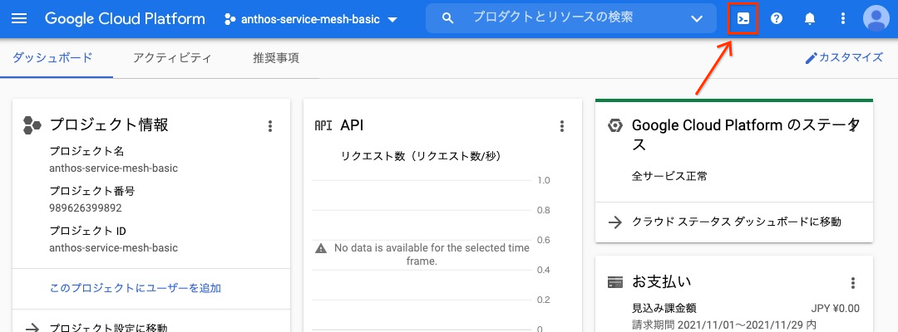

author: Kozzy Hasebe
summary: Anthos Service Mesh basic level hands-on
id: anthos-service-mesh-basic-handson
categories: codelab,markdown
environments: Web
status: Published
feedback link: https://github.com/hasebe/asm-handson-asset

# Anthos Service Mesh Basic Hands-on

## 概要

Duration: 0:05:00

このハンズオンでは Anthos Service Mesh の導入から、設定を通じてサービスメッシュの基礎的な機能を学習します。

### 1.1 利用プロダクト

- [Google Kubernetes Engine](https://cloud.google.com/kubernetes-engine/)
- [Anthos Service Mesh](https://cloud.google.com/anthos/service-mesh)
- [Cloud Operations](https://cloud.google.com/products/operations)

### 1.2 前提知識

- Kubernetes の操作、基礎的な Kubernetes リソース (Service, Deployment, Pod)

### 1.3 前提条件

本ハンズオンは、Billing が有効な Google Cloud プロジェクトで行うこと、また各種コマンドは Cloud Shell で実行することを前提としています。環境がない場合は、事前に Google Cloud プロジェクトをご用意ください。

## 事前準備

### 2.1 Google Cloud Console へアクセス

[こちら](https://console.cloud.google.com/) から Google Cloud Console にブラウザでアクセスします。

### 2.2 Cloud Shell の起動

各種コマンドを実行するための CLI 環境である Cloud Shell を開きます。下図の中のリンクをクリックし、Cloud Shell を開きます。



### 2.3 Google Cloud プロジェクトの設定

ハンズオンを実行する対象の Google Cloud プロジェクトを設定します。コマンドの `XXXXXXXX` の部分を実際のプロジェクト ID に置き換えて実行します。プロジェクト ID は[ダッシュボード画面](https://console.cloud.google.com/home/dashboard)のプロジェクト情報カードから確認ができます。

```shell
export PROJECT_ID=XXXXXXXX
gcloud config set project ${PROJECT_ID}
```

コマンド実行後に以下の様に Cloud Shell のプロンプトに、黄色の文字でプロジェクト ID が表示されていることを確認します。


### 2.4 資材のダウンロード

ハンズオン用のフォルダを作成し、ハンズオンの資材をクローンします。

```shell
mkdir -p asm-handson && cd asm-handson
git clone https://github.com/hasebe/asm-handson-asset
```

## Google Kubernetes Engine (GKE) クラスタ作成

### 3.1 GKE, Cloud Operations の有効化

Google Cloud では以下のような各種機能を API として提供しており、Google Cloud プロジェクトの作成直後は、ほぼすべての機能が無効化されております。そのため、使いたい機能は事前に有効化する必要があります。ここではアプリケーションをデプロイする対象の GKE、Cloud の運用機能である Cloud Operations を有効化します。

```shell
gcloud services enable container.googleapis.com \
  monitoring.googleapis.com \
  cloudtrace.googleapis.com \
  clouddebugger.googleapis.com \
  cloudprofiler.googleapis.com
```

### 3.2 GKE クラスタ作成

アプリケーション、Anthos Service Mesh を稼働させる GKE クラスタを作成します。

```shell
gcloud container clusters create asm-cluster \
  --workload-pool ${PROJECT_ID}.svc.id.goog \
  --release-channel regular \
  --logging=SYSTEM,WORKLOAD \
  --monitoring=SYSTEM \
  --num-nodes 2 \
  --machine-type e2-standard-4 \
  --zone asia-northeast1-b
```

<aside class="negative">
注: 作成完了まで最大 10 分程度かかることがあります。
</aside>

## サンプルアプリケーションのデプロイ

### 4.1 アーキテクチャ

今回使用するアプリケーションは EC サイトを模したもので、マイクロサービス アーキテクチャにより作られています。以下のようなアーキテクチャ構成になっています。


### 4.2 デプロイ

サンプルアプリケーションを GKE にデプロイします。

```shell
kubectl apply -f asm-handson-asset/manifests/online-boutique.yaml
```

### 4.3 アプリケーションの動作確認

アプリケーションは Kubernetes の Service リソースである frontend-external (Type: LoadBalancer) を通じて外部からアクセスできます。実際に外部からアクセスをしてみましょう。

```shell
kubectl get service frontend-external -n frontend
```

`EXTERNAL-IP` 列にグローバル IP アドレスが表示されるまでコマンドを複数回実行します。表示されたらそのアドレスをブラウザに貼り付けてアクセスし、アプリケーションを確認します。

### 4.4 バランシングの確認

30 回トップページにアクセスします。v1, v2, v3 それぞれ同数の Pod があるため、環境の表示回数 (Google Cloud, AWS, Azure) はほぼ同数となるはずです。

```shell
EXTERNAL_IP=$(kubectl get svc frontend-external -n frontend -o jsonpath='{.status.loadBalancer.ingress[0].ip}')
for i in $(seq 30); do curl -s http://${EXTERNAL_IP}/ | grep -e 'Google Cloud' -e 'AWS' -e 'Azure'; done | sort | uniq -c
```

<aside class="positive">
Note: Kubernetes の Service ではデフォルトで、バックエンドの Pod にラウンドロビンでバランシングされます。つまり Pod を増減させることでアクセス割合を調整します。
</aside>

## Anthos Service Mesh (ASM) の導入

### 5.1 インストール スクリプトのダウンロード、実行権限の付与

インストールするためのスクリプトをダウンロードし、実行できるようにします。

```shell
curl https://storage.googleapis.com/csm-artifacts/asm/asmcli_1.11 > asmcli
chmod a+x asmcli
```

### 5.2 ASM のインストール

先程ダウンロードしたスクリプトを使い、ASM をインストールします。

```shell
./asmcli install \
  --project_id ${PROJECT_ID} \
  --cluster_name asm-cluster \
  --cluster_location asia-northeast1-b \
  --fleet_id ${PROJECT_ID} \
  --output_dir asm_output \
  --enable_all \
  --managed
```

<aside class="positive">
"--managed" のオプションを指定し、マネージド コントロールプレーンを有効にしたインストールを行います。通常クラスタ上で稼働する istiod などのコンポーネントは、Google 管理の環境で動き、利用者自身が管理する必要がなくなります。
</aside>

<aside class="negative">
注: インストール完了まで最大 10 分程度かかることがあります。
</aside>

### 5.3 Ingress Gateway の作成

ASM (Istio) ではメッシュに入るトラフィック、メッシュからでていくトラフィックを制御するためのコンポーネントとして、`Ingress Gateway`, `Egress Gateway` が用意されています。外部からアクセスを受け付けるために Ingress Gateway が必要ですが ASM をインストールしただけでは作成されないので、手動で作成します。

```shell
kubectl create namespace ingress-gateway
kubectl label namespace ingress-gateway istio.io/rev=asm-managed --overwrite
kubectl apply -n ingress-gateway -f asm_output/samples/gateways/istio-ingressgateway
```

### 5.4 自動サイドカープロキシ挿入の有効化

今の段階では ASM はインストールされていますが、前節でデプロイしたアプリケーションにはサイドカープロキシが動いておらず、サービスメッシュの機能を利用することができません。まず、アプリケーションが動いているネームスペースそれぞれで、自動サイドカープロキシ挿入を有効化します。

```shell
for ns in ad cart checkout currency email frontend loadgenerator payment product-catalog recommendation shipping; do
  kubectl label namespace ${ns} istio.io/rev=asm-managed --overwrite
done
```

### 5.5 アプリケーションへのサイドカープロキシの挿入

自動サイドカープロキシ挿入を有効化しただけでは、プロキシは挿入されません。既存のアプリケーションの場合、Deployment (Pod) を再起動する必要があります。

```shell
for ns in ad cart checkout currency email frontend loadgenerator payment product-catalog recommendation shipping; do
  kubectl rollout restart deployment -n ${ns}
done
```

### 5.6 サイドカー挿入の確認

それぞれの Pod を確認し、1 Pod あたり 2 つのコンテナが動いていること(READY 列が 2/2 となっていること)を確認します。

```shell
kubectl get pod --all-namespaces | grep -v system | grep -v gke-connect | grep -v istio-ingressgateway
```

以下のような表示になっていれば成功です。

```console
NAMESPACE         NAME                                                    READY   STATUS    RESTARTS   AGE
ad                adservice-6f59ffb55c-f8jhl                              2/2     Running   0          3m29s
cart              cartservice-6586dd9664-wg8hx                            2/2     Running   0          3m28s
checkout          checkoutservice-78557559d-zzsz9                         2/2     Running   0          3m28s
currency          currencyservice-85544d86b7-zqpwj                        2/2     Running   0          3m27s
email             emailservice-7cdbd97bf9-trpmd                           2/2     Running   0          3m27s
frontend          frontend-v1-88bbd8f5-nqnnl                              2/2     Running   0          3m26s
frontend          frontend-v2-7557f9dd85-xdsdm                            2/2     Running   0          3m26s
frontend          frontend-v3-7d4b689b76-tgrxj                            2/2     Running   0          3m26s
loadgenerator     loadgenerator-f499656d4-mws9g                           2/2     Running   2          3m25s
payment           paymentservice-79d579bdbf-96ffr                         2/2     Running   0          3m25s
product-catalog   productcatalogservice-6676456f79-qszk5                  2/2     Running   0          3m25s
recommendation    recommendationservice-577d6f45d4-lxhbz                  2/2     Running   0          3m24s
shipping          shippingservice-749d9b68d6-274bp                        2/2     Running   0          3m23s
```

### 5.7 Gateway の設定

5.3 で Ingress Gateway を作成しましたが、まだそちらを通して外部からアクセスをする設定が完了していません。Gateway, VirtualService リソースを作成し、Ingress Gateway を通して frontend にアクセスをできるようにします。

```shell
kubectl apply -f asm-handson-asset/manifests/networking.yaml
```

### 5.8 Ingress Gateway からのアプリケーションのアクセス確認

Ingress Gateway を通してアプリケーションが正しく動いているかを確認します。

```shell
INGRESS_IP=$(kubectl get svc istio-ingressgateway -n ingress-gateway -o jsonpath='{.status.loadBalancer.ingress[0].ip}')
echo http://${INGRESS_IP}/
```

## トラフィック管理 - VirtualService

トラフィック管理では [VirtualService](https://istio.io/latest/docs/concepts/traffic-management/#virtual-services) と [DestinationRule](https://istio.io/latest/docs/concepts/traffic-management/#destination-rules) を使いこなせるようになることが重要です。

VirtualService はメッシュの中で、**どのようなリクエストがどこにルーティングされるか(ルーティング ルール)**を設定します。また VirtualService は通常複数のルーティング ルールで構成されています。詳細については[こちら](https://istio.io/latest/docs/reference/config/networking/virtual-service/)をご参照ください。

VirtualService の一般的な構成をいくつか見てみましょう。

### 6.1 デフォルト ルーティングルール

```yaml
apiVersion: networking.istio.io/v1alpha3
kind: VirtualService
metadata:
  name: reviews # VirtualService 名。VirtualService の振る舞いとの関連はない
spec:
  hosts:
    - reviews # クライアントがリクエストを送る仮想ホスト名で IP アドレス、DNS 名、またワイルドカード "*" などが指定できる。実際にルーティングできるホスト名である必要はない
  http: # ここから下がルーティング ルールの設定
    - match:
        - headers: # リクエストヘッダの
            end-user: # end-user フィールドに
              exact: jason # jason が入っている場合
      route:
        - destination:
            host: reviews # reviews の
            subset: v2 # v2 にルーティングする
    - route: # ここまでの条件にマッチしなかったリクエストはすべて
        - destination:
            host: reviews # reviews の
            subset: v3 # v3 にルーティングする
```

<aside class="negative">
注: ルーティング ルール内の host 設定は、実際にルーティング可能なホスト名でなければなりません。
</aside>

### 6.2 複数のルーティングルール

```yaml
apiVersion: networking.istio.io/v1alpha3
kind: VirtualService
metadata:
  name: bookinfo
spec:
  hosts:
    - bookinfo.com # メッシュ内で bookinfo.com へのリクエストに対してこの VirtualService が適用される
  http:
    - match:
        - uri: # リクエスト URI の
            prefix: "/reviews" # プレフィックスが /reviews だった場合
      route:
        - destination:
            host: reviews # reviews にルーティングする
    - match:
        - uri: # リクエスト URL の
            prefix: "/ratings" # プレフィックスが /ratings だった場合
      route:
        - destination:
            host: ratings # ratings にルーティングする
```

<aside class="negative">
注: ルーティング ルールは上に書いてあるものから順番に評価されます。
</aside>

### 6.3 高度な設定 (重み付けトラフィック分割)

```yaml
apiVersion: networking.istio.io/v1alpha3
kind: VirtualService
metadata:
  name: reviews
spec:
  hosts:
    - reviews # メッシュ内で reviews へのリクエストに対してこの VirtualService が適用される
  http:
    - route: # 必ず以下のルーティングが行われる
        - destination:
            host: reviews # reviews の
            subset: v1 # v1 に
          weight: 75 # 75 % のリクエストをルーティングする
        - destination:
            host: reviews # reviews の
            subset: v2 # v2 に
          weight: 25 # 25 % のリクエストをルーティングする
```

## トラフィック管理 - DestinationRule

VirtualService がどのようにトラフィックをルーティングするか、を設定するのに対し、DestinationRule は**ルーティングが決定された後のトラフィックの挙動**を制御することができます。そのため、DestinationRule は VirtualService が評価された後に評価されます。

DestinationRule を使うと、下記のような設定ができます。

- 負荷分散方式
  - ランダム
  - ラウンドロビン
  - 重み付け
  - 最小リクエスト
- TLS セキュリティ設定
- サーキット ブレーカー設定
- Pod のラベルに応じたサブセット設定

これ以外にも様々な設定が可能です。詳細については[こちら](https://istio.io/latest/docs/reference/config/networking/destination-rule/)をご参照ください。

ここでもいくつか、DestinationRule の構成例を見てみます。

### 7.1 サブセット構成

```yaml
apiVersion: networking.istio.io/v1alpha3
kind: DestinationRule
metadata:
  name: reviews
spec:
  host: reviews # reviews へのリクエスト(VirtualService 評価後)を対象にサブセットを作成する
  subsets:
    - name: v1
      labels:
        version: v1 # version: v1 というラベルが付いている Pod を v1 サブセットとする (このサブセットを VirtualService から指定できる)
    - name: v2
      labels:
        version: v2 # version: v2 というラベルが付いている Pod を v2 サブセットとする
    - name: v3
      labels:
        version: v3 # version: v3 というラベルが付いている Pod を v3 サブセットとする
```

### 7.2 負荷分散方式の設定

```yaml
apiVersion: networking.istio.io/v1alpha3
kind: DestinationRule
metadata:
  name: my-destination-rule
spec:
  host: my-svc # my-svc へのリクエスト(VirtualService 評価後)を対象に設定する
  trafficPolicy:
    loadBalancer:
      simple: RANDOM # デフォルトの負荷分散方式はランダムとする
  subsets:
    - name: v1
      labels:
        version: v1 # version: v1 というラベルが付いている Pod を v1 サブセットとする
    - name: v2
      labels:
        version: v2 # version: v2 というラベルが付いている Pod を v2 サブセットとする
      trafficPolicy:
        loadBalancer:
          simple: ROUND_ROBIN # v2 サブセットの負荷分散方式はラウンドロビンとする
    - name: v3
      labels:
        version: v3 # version: v3 というラベルが付いている Pod を v3 サブセットとする
```

## トラフィック管理 - リクエスト ルーティング

初期状態では Pod のラベルが異なる frontend-v1, frontend-v2, frontend-v3 の 3 つの Deployment が作られています。それぞれ環境名が異なっており順番に Google Cloud, AWS, Azure となっています。

まだメッシュ外からのアクセスを受け付ける設定以外、VirtualService, DestinationRule とも設定されていません。それらを作成し、各バージョンへのアクセスを制御してみましょう。

### 8.1 DestinationRule の作成

バージョンが Pod のラベルで分かれており、それをベースにルーティングを制御するには、サブセットを作成する必要があります。

```shell
cat << EOF > frontend-dr.yaml
apiVersion: networking.istio.io/v1alpha3
kind: DestinationRule
metadata:
  name: frontend-dr
  namespace: frontend
spec:
  host: frontend
  subsets:
    - name: v1
      labels:
        version: v1
    - name: v2
      labels:
        version: v2
    - name: v3
      labels:
        version: v3
EOF
kubectl apply -f frontend-dr.yaml
```

### 8.2 割合ベースのトラフィック分割 (v1: 50%, v2: 25%, v3: 25%)

```shell
cat << EOF > frontend-vs.yaml
apiVersion: networking.istio.io/v1alpha3
kind: VirtualService
metadata: # kpt-merge: frontend/frontend-ingress
  name: frontend-ingress
  namespace: frontend
spec:
  hosts:
    - "*"
  gateways:
    - frontend-gateway
  http:
    - route:
        - destination:
            host: frontend
            subset: v1
            port:
              number: 80
          weight: 50
        - destination:
            host: frontend
            subset: v2
            port:
              number: 80
          weight: 25
        - destination:
            host: frontend
            subset: v3
            port:
              number: 80
          weight: 25
EOF
kubectl apply -f frontend-vs.yaml
```

### 8.3 アクセス確認

期待通りに動いているか下記のコマンドで確認します。

```shell
INGRESS_IP=$(kubectl get svc istio-ingressgateway -n ingress-gateway -o jsonpath='{.status.loadBalancer.ingress[0].ip}')
for i in $(seq 30); do curl -s http://${INGRESS_IP}/ | grep -e 'Google Cloud' -e 'AWS' -e 'Azure'; done | sort | uniq -c
```

Google Cloud が 50 %, AWS, Azure が 25 % くらいの割合に変わっていれば成功です。

### 8.4 チャレンジ問題 - リクエスト ルーティング

frontend のすべてのアクセスを v1 (Google Cloud) にルーティングするように設定をしてみましょう。前の手順で作成した VirtualService を更新することで実現できます。

### 8.5 アクセス確認

再度動作を確認します。

```shell
INGRESS_IP=$(kubectl get svc istio-ingressgateway -n ingress-gateway -o jsonpath='{.status.loadBalancer.ingress[0].ip}')
for i in $(seq 30); do curl -s http://${INGRESS_IP}/ | grep -e 'Google Cloud' -e 'AWS' -e 'Azure'; done | sort | uniq -c
```

## トラフィック管理 - フォールト インジェクション

サービスメッシュではアプリケーションに変更を加えること無く、以下のような設定(フォールト)を挿入することができます。

- 特定の HTTP レスポンス
  - 4xx, 5xx, 3xx
- 特定秒数の遅延

この機能を利用することで、以下のような実現に手間がかかるテストシナリオを簡単にテストできます。

- currencyservice は 100 % の割合で、レスポンスが 1 秒遅延する
- productcatalogservice は 20 % の割合で、503 を返す

実際に 2 つのシナリオを試してみましょう。

### 9.1 currencyservice - レスポンス遅延: 1 秒, 割合: 100%

```shell
cat << EOF > currency-vs.yaml
apiVersion: networking.istio.io/v1alpha3
kind: VirtualService
metadata:
  name: currency-vs
  namespace: currency
spec:
  hosts:
    - currencyservice
  http:
    - fault:
        delay:
          fixedDelay: 1s
          percentage:
            value: 100
      route:
        - destination:
            host: currencyservice
EOF
kubectl apply -f currency-vs.yaml
```

### 9.2 アクセス確認

今回はブラウザからアクセスをし、動作を確認します。

```shell
INGRESS_IP=$(kubectl get svc istio-ingressgateway -n ingress-gateway -o jsonpath='{.status.loadBalancer.ingress[0].ip}')
echo http://${INGRESS_IP}/
```

トップページへのアクセスが明らかに遅いことが確認できます。1 秒の遅延しか入れていないのに、なぜここまで遅くなるかを考えてみましょう。

### 9.3 遅延設定の解除

currencyservice に設定していた遅延を削除します。

```shell
kubectl delete -f currency-vs.yaml
```

### 9.4 productcatalogservice - エラーレスポンス: 503, 割合: 20 %

```shell
cat << EOF > productcatalog-vs.yaml
apiVersion: networking.istio.io/v1alpha3
kind: VirtualService
metadata:
  name: productcatalog-vs
  namespace: product-catalog
spec:
  hosts:
    - productcatalogservice
  http:
    - fault:
        abort:
          httpStatus: 503
          percentage:
            value: 20
      route:
        - destination:
            host: productcatalogservice
EOF
kubectl apply -f productcatalog-vs.yaml
```

### 9.5 アクセス確認

ここでもブラウザからアクセスをし、動作を確認します。

```shell
INGRESS_IP=$(kubectl get svc istio-ingressgateway -n ingress-gateway -o jsonpath='{.status.loadBalancer.ingress[0].ip}')
echo http://${INGRESS_IP}/
```

様々なページを開いてみるとかなりの割合で 500 エラーがでることがわかります。20 % のエラー発生率であっても、様々なサービスから呼ばれているため影響が大きくなってしまうことがわかります。

### 9.6 エラー設定の解除

currencyservice に設定していた遅延を削除します。

```shell
kubectl delete -f productcatalog-vs.yaml
```

## 可観測性 - ASM UI

サービスメッシュの大きな機能の一つに可観測性の向上があります。サイドカー プロキシがサービス間の連携を管理しているため、そのプロキシからログ情報、メトリクスを出力することで、メッシュ内の状況をアプリケーションに変更を加えること無く、可視化することが可能です。

ASM ではインストールをするだけで、様々な情報が UI から見えるようになります。ここでは実際に UI を操作し、デプロイしているアプリケーションの現在の状況を見てみます。

### 10.1 4 つのゴールデン シグナル

Google ではカスタマー フェイシングなサービスを監視する場合、下記に示す 4 つのメトリクスが最重要なものと位置づけています。SRE 本の該当記述箇所は[こちら](https://sre.google/sre-book/monitoring-distributed-systems/)をご参照ください。

- レイテンシー
  - 正常なリクエストと、エラーリクエストは分けてレイテンシーを測ること
- トラフィック
  - どれだけアクセスが来ているか、通常**リクエスト / 秒**が使われる
- エラー
  - どれだけの割合でエラーが発生しているか
- サチュレーション(飽和度)
  - どれだけサービスに負荷が来ているか。サービスのボトルネックを中心に測定する(例えばメモリがボトルネックになる場合、使用メモリ割合、I/O にボトルネックがある場合、I/O 負荷状況をみる)

ASM ではこれらのシグナルをデフォルトで可視化しています。[こちら](https://console.cloud.google.com/anthos/services)からブラウザでアクセスしてみます。


### 10.2 トポロジービュー

メッシュ内の各サービスがどのように連携しているかを、実際の連携状況を元に可視化することができます。xxx からアクセスして確認します。


### 10.3 各サービスごとの詳細情報

上記で紹介した情報以外にもサービスごとに以下の情報を UI から確認できます。実際にアクセスをして見てみましょう。

- 概要
  - ひと目で各種重要情報を確認
- 健全性
  - SLO の状況
- 指標
  - メトリクスのグラフ、アラート、ログ、トレース
- 連携サービス
  - 他サービスとの連携状況
- 診断
  - エラーログ、アラート
- インフラストラクチャ
  - メトリクスのグラフ、Pod の状況
- Traffic
  - トラフィックのメトリクス、ルーティング状況
- セキュリティ
  - セキュリティ設定の状況
- リソース
  - サービス関連リソース (ASM リソースも含む)


## 可観測性 - SLO モニタリング

ASM で出力したメトリクスを利用して、簡単に SLO のモニタリングを行うことができます。実際に SLO を設定してみます。

ここではアプリケーションの入り口である frontend サービスを対象に、エラーレートを使い SLO を設定しましょう。

### 11.1 SLO の作成

1. [こちら](https://console.cloud.google.com/anthos/services/service/frontend/frontend/health) から frontend サービスの健全性画面に遷移します。
1. **SLO を作成** ボタンをクリック
1. サービスレベル指標 (SLI) の設定
   1. 指標の選択は **可用性** が選択されていることを確認
   1. リクエスト ベースまたは Windows ベースの選択は **リクエスト ベース** が選択されていることを確認
   1. **続行** ボタンをクリック
1. SLI の詳細を定義する
   1. **続行** ボタンをクリック
1. SLO の設定
   1. コンプライアンス期間 - 期間の種類: **連続** を選択
   1. コンプライアンス期間 - 期間の長さ: **1 日** に設定
   1. パフォーマンス目標: **95 %** に設定
   1. **続行** ボタンをクリック
1. 確認と保存
   1. **SLO を作成** ボタンをクリック

今の段階では下図のように、エラーバジェット内であることを確認します。


### 11.2 SLO アラートの作成

1. 先程作成した SLO から **SLO アラートの作成** ボタンをクリック
1. SLO のアラート条件の設定
   1. ルックバック期間: **5 minutes** に設定
   1. バーンレートのしきい値: **10** に設定
   1. **次へ** ボタンをクリック
1. Who should be notified? (通知を受け取るメンバーの設定)
   1. **次へ** ボタンをクリック
1. What are the steps to fix the issue? (問題を解決する手順)
   1. **SAVE** ボタンをクリック

アラートが設定され、発報されていないことを確認します。


### 11.3 currencyservice にエラーを挿入

トラフィック管理のフォールト インジェクションで学んだ方法を使い、意図的に currencyservice にエラーを挿入します。そうすることで、frontend が影響を受け、エラーが増え結果的にアラートが発報することを確認します。

```shell
cat << EOF > currency-vs.yaml
apiVersion: networking.istio.io/v1alpha3
kind: VirtualService
metadata:
  name: currency-vs
  namespace: currency
spec:
  hosts:
    - currencyservice
  http:
    - fault:
        abort:
          httpStatus: 503
          percentage:
            value: 100
      route:
        - destination:
            host: currencyservice
EOF
kubectl apply -f currency-vs.yaml
```

設定後少し待ち、frontend サービスの健全性の画面が下記のように変わることを確認します。


## クリーンアップ

環境のクリーンアップを行います。

### プロジェクトの削除

最も簡単な方法は Google Cloud プロジェクトごと削除する方法です。

```shell
gcloud projects delete ${PROJECT_ID} --quiet
```
